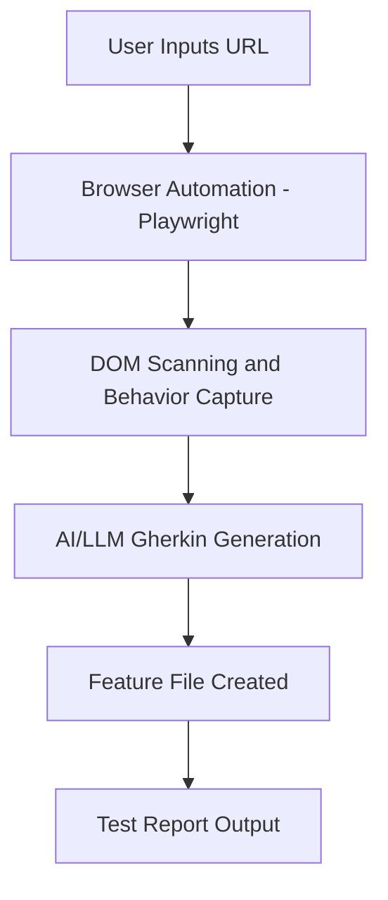

# AI-Based Dynamic Gherkin Test Generation System - Detailed Use Case

## 📌 Overview

This solution focuses on dynamically generating **BDD Gherkin test scenarios** for websites that contain hover-triggered or popup/overlay interactions. It enables fully automated UI test scenario creation without manual inspection or hardcoded selectors.

---

## 🎯 Objective

The primary objective is to:

* Accept a **website URL** as input.
* Automatically detect **hoverable UI elements** such as dropdown menus, tooltip overlays, and image-based hover reveals.
* Identify **popup/modal behaviors** triggered by actions like clicking buttons.
* Simulate user actions using **browser automation**.
* Track DOM changes and behavior outcomes.
* Dynamically generate **clean and readable Gherkin test scenarios**.
* Export the scenarios into **.feature files**.

---

## 🧠 Problem Context

Modern dynamic websites make heavy use of interactive UI patterns:

* Hover menus in navigation bars
* Banner overlays
* Tooltip pop-ups
* Buttons that trigger confirmation modals

Manual test script writing for such interactions is **time-consuming** and **error-prone**.
This automation solution covers:

✔️ UI discovery
✔️ Behavioral interaction
✔️ Test case generation

---

## ✨ Key Use Cases

### 📌 Use Case 1 — Detect Hover-Based Interactions

The system:

1. Scans DOM to identify hover-intent elements.
2. Performs hover using browser automation.
3. Detects visible elements newly revealed due to hover.
4. Logs clickable elements.
5. Generates Gherkin scenarios for user navigation cases.

**Example Behavior**:

* Hover over "About Us" ⇒ dropdown appears
* Click "Team" ⇒ URL should change

→ Automated Test Scenario:

```gherkin
When the user hovers on "About Us"
Then dropdown should appear
And the user clicks "Team"
Then the page URL should change accordingly
```

---

### 📌 Use Case 2 — Detect Popup/Overlay Behavior

The system should:

1. Interact with action-triggering elements (e.g., CTA buttons).
2. Detect if a modal or overlay appears.
3. Capture modal title, message text & available action buttons.
4. Generate Gherkin test ensuring modal correctness & redirection.

**Example Behavior**:

* Click "Learn More" ⇒ popup “You are leaving site” opens
* Click Cancel ⇒ stay on same page
* Click Continue ⇒ navigate to external URL

→ Automated Test Scenario:

```gherkin
When the user clicks "Learn More"
Then a popup should appear with correct warning text
And clicking "Continue" should redirect to a new URL
```

---

## 🔄 System Workflow



---

## 🧩 Functional Requirements

| Requirement      | Description                                        |
| ---------------- | -------------------------------------------------- |
| Input            | One valid website URL                              |
| Detection        | Hover elements + revealed clickable elements       |
| Popup Handling   | Identify modals, verify title/messages             |
| Simulation       | Hover + click interactions via Playwright/Selenium |
| Output Format    | Gherkin `.feature` file                            |
| Test Cases Count | Minimum **two** automated scenarios generated      |

---

## ⚙️ Technical Requirements

| Layer                | Recommended Tech          |
| -------------------- | ------------------------- |
| Browser Automation   | Playwright / Selenium     |
| DOM Analysis         | BeautifulSoup / lxml      |
| Reasoning Engine     | GPT-4/5 / Gemini / Ollama |
| API Backend          | FastAPI                   |
| Storage *(optional)* | SQLite / JSON             |
| UI *(optional)*      | Streamlit                 |

> You can choose any Python-based tech stack as long as above requirements are met.

---

## 🛑 Constraints / Challenges

* Avoid **any hardcoded selectors**
* Work across **multiple website structures**
* Handle asynchronous UI loads
* Popups may render outside predictable DOM structure
* Accessibility not guaranteed

---

## 🎯 Expected Deliverables

✔ Source Code (GitHub Repo)
✔ README with setup instructions
✔ Demo Video (≤ 7 minutes)
✔ Sample `.feature` output
✔ Two validated tests per URL

---

## 🧪 Output Example - Gherkin BDD

A `.feature` file containing:

* Feature title
* Detailed Scenario
* Given / When / Then steps
* Assertions like: visibility, redirection, behavior validation

```gherkin
Feature: Validate navigation menu functionality
Scenario: Verify hover-based dropdown navigation
Given the user is on the homepage
When the user hovers over the navigation menu "About"
Then a dropdown should appear
And clicking "Services" should redirect properly
```

---

## ✔️ Success Criteria

| Parameter                | Target                                               |
| ------------------------ | ---------------------------------------------------- |
| Zero Manual Intervention | 100% dynamic element detection                       |
| Output Usability         | Testers can directly use Gherkin in automation tools |
| Website Compatibility    | Works on highly dynamic modern websites              |
| Efficiency               | Execution within a reasonable time                   |

---

## 🔍 Target Users

* QA Automation Engineers
* Testing Teams for large web platforms
* DevOps teams integrating automated UI validation
* AI-enhanced CI/CD pipelines

---

## 🚀 Future Enhancements

* Multi-page crawl for expanded scenario discovery
* Visual validation using screenshot diff
* Multi-browser compatibility
* CI/CD plugin to auto-generate tests on deployment

---

## 🏁 Conclusion

This AI-powered testing framework enhances UI automation by generating **automated Gherkin tests** without writing a single test script manually. It significantly improves scalability and reduces human effort in end-to-end UI testing.