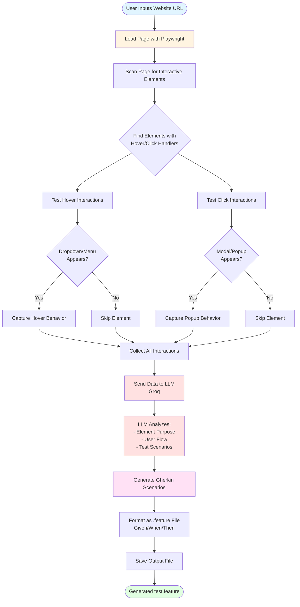
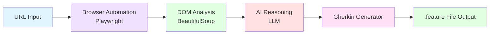
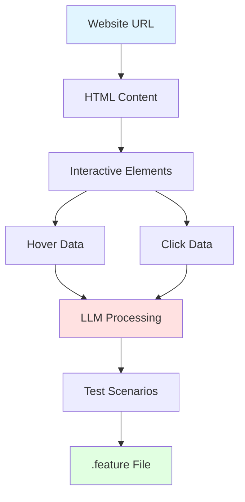

# High-Level Design - Workflow

```mermaid
flowchart TD
    Start([User Inputs Website URL]) --> Load[Load Page with Playwright]
    
    Load --> Scan[Scan Page for Interactive Elements]
    
    Scan --> FindElements{Find Elements with<br/>Hover/Click Handlers}
    
    FindElements --> TestHover[Test Hover Interactions]
    FindElements --> TestClick[Test Click Interactions]
    
    TestHover --> HoverResult{Dropdown/Menu<br/>Appears?}
    HoverResult -->|Yes| CaptureHover[Capture Hover Behavior]
    HoverResult -->|No| Skip1[Skip Element]
    
    TestClick --> ClickResult{Modal/Popup<br/>Appears?}
    ClickResult -->|Yes| CapturePopup[Capture Popup Behavior]
    ClickResult -->|No| Skip2[Skip Element]
    
    CaptureHover --> Collect[Collect All Interactions]
    CapturePopup --> Collect
    Skip1 --> Collect
    Skip2 --> Collect
    
    Collect --> SendLLM[Send Data to LLM<br/>Groq]
    
    SendLLM --> AIAnalysis[LLM Analyzes:<br/>- Element Purpose<br/>- User Flow<br/>- Test Scenarios]
    
    AIAnalysis --> Generate[Generate Gherkin Scenarios]
    
    Generate --> Format[Format as .feature File<br/>Given/When/Then]
    
    Format --> Save[Save Output File]
    
    Save --> End([Generated test.feature])
    
    style Start fill:#e1f5ff
    style Load fill:#fff4e1
    style SendLLM fill:#ffe1e1
    style AIAnalysis fill:#ffe1e1
    style Generate fill:#ffe1f5
    style End fill:#e1ffe1
```

## Component Flow

```mermaid
flowchart LR
    A[URL Input] --> B[Browser Automation<br/>Playwright]
    B --> C[DOM Analysis<br/>BeautifulSoup]
    C --> D[AI Reasoning<br/>LLM]
    D --> E[Gherkin Generator]
    E --> F[.feature File Output]
    
    style A fill:#e1f5ff
    style B fill:#f0e1ff
    style C fill:#e1ffe1
    style D fill:#ffe1e1
    style E fill:#ffe1f5
    style F fill:#e1ffe1
```

## Data Flow

```mermaid
flowchart TD
    URL[Website URL] --> HTML[HTML Content]
    HTML --> Elements[Interactive Elements]
    
    Elements --> Hover[Hover Data]
    Elements --> Click[Click Data]
    
    Hover --> AI[LLM Processing]
    Click --> AI
    
    AI --> Scenarios[Test Scenarios]
    Scenarios --> Gherkin[.feature File]
    
    style URL fill:#e1f5ff
    style AI fill:#ffe1e1
    style Gherkin fill:#e1ffe1
```